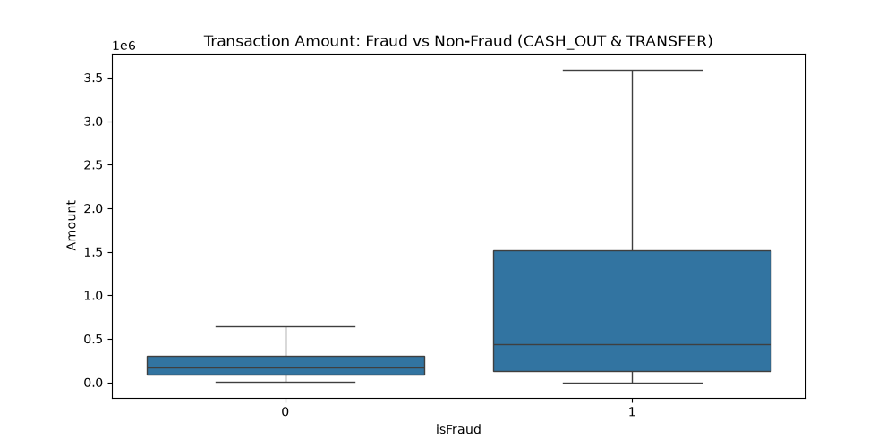

# Mobile Money Fraud Detection (Kenya Fintech Context)

A statistical and machine learning analysis of mobile money transactions to identify fraud patterns, using a dataset modeled on mobile money systems like M-Pesa.

## Problem

Mobile money fraud is a serious issue in Kenya's cashless economy and is on the rise. This encompasses fake till scams and cashout/transfer to victim accounts. Banks and mobile money operators have a need to identify suspicious transactions as they are occurring but not block undue numbers of legitimate ones. The aim of this project is to investigate a huge transaction dataset and to find one simple answer: can we predict which transactions are likely fraud and what is the signal of fraud?

## Dataset

**Synthetic Financial Datasets For Fraud Detection (PaySim)**. Available on [Kaggle](https://www.kaggle.com/datasets/ealaxi/paysim1). It simulates mobile money transactions and includes 6.36 million records.

Columns used: `step`, `type`, `amount`, `oldbalanceOrg`, `newbalanceOrig`, `oldbalanceDest`, `newbalanceDest`, `isFraud`.

## Tools Used

Python (pandas, numpy, scipy, scikit-learn, matplotlib, seaborn)

## Approach

1. Inspect and clean the data
2. Check class balance and see which transaction types actually contain fraud
3. Check account balance behavior for signs of mule accounts
4. Visualize transaction amounts for fraud vs. non-fraud
5. Run a t-test to check if the amount difference is statistically significant
6. Run an ANOVA to see if amount varies significantly across transaction types
7. Build a logistic regression model to predict fraud
8. Catch and fix a multicollinearity issue, then finalize the model


## 1. Data Overview

First step was just checking what I was working with. The size, structure, and whether there were any missing values to deal with.

```python
import pandas as pd

Dataset = pd.read_csv(r"C:\Users\HomePC\Downloads\archive (3)\PS_20174392719_1491204439457_log.csv")

print(Dataset.shape)
print(Dataset.info())
print(Dataset.head())
print(Dataset.isnull().sum())
```

**Result:** 6,362,620 rows, 11 columns, no missing values. No cleaning was needed.


## 2. Class Balance & Transaction Types

Before anything else, I wanted to know how rare fraud actually is, and whether it shows up across all transaction types or just some.

```python
print(Dataset['isFraud'].value_counts())
print(Dataset['isFraud'].value_counts(normalize=True) * 100)
print(Dataset['type'].value_counts())
print(pd.crosstab(Dataset['type'], Dataset['isFraud']))
```

**What I found:**
-Fraud makes up only **0.13%** of all transactions (8,213 out of 6.36 million) — a heavily imbalanced dataset.
-very single fraud case happens in either `CASH_OUT` or `TRANSFER`. The other three types — `CASH_IN`, `PAYMENT`, `DEBIT` have zero fraud cases between them, despite covering 3.59 million transactions.

This is the typical way that mobile money fraud occurs in real life. Money is moved out by transfer and then cashed out rather than payments or debits.


## 3. Balance Consistency Check

I then examined whether account balances make sense around each account transaction, and in particular, whether there are “mule accounts” which are accounts that have no money on them before or after receiving money, which is used to do money laundering.

```python
Dataset['balanceDiffOrig'] = Dataset['oldbalanceOrg'] - Dataset['amount'] - Dataset['newbalanceOrig']
Dataset['balanceDiffDest'] = Dataset['oldbalanceDest'] + Dataset['amount'] - Dataset['newbalanceDest']

print(Dataset['balanceDiffOrig'].describe())
print(Dataset['balanceDiffDest'].describe())
print(Dataset[(Dataset['oldbalanceDest'] == 0) & (Dataset['newbalanceDest'] == 0)]['isFraud'].value_counts())
```

**What I found:**
-Balances don't always add up perfectly. This is a phenomena characteristic of PaySim merchant account simulation, not necessarily a fraud in itself.
-About 50% of fraud cases involve a destination account with zero balance before and after, compared to 36% of legitimate transactions. It is not a clear-cut signal on its own, but rather a feature of the model. THis can be useful but cannot be used as a stand-alone rule.

## 4. Amount Distribution: Fraud vs. Non-Fraud

I narrowed the data down to just `CASH_OUT` and `TRANSFER` which are the only types with fraud and compared transaction amounts.

```python
import matplotlib.pyplot as plt
import seaborn as sns

subset = Dataset[Dataset['type'].isin(['CASH_OUT', 'TRANSFER'])]
plt.figure(figsize=(10, 5))
sns.boxplot(x='isFraud', y='amount', data=subset, showfliers=False)
plt.title('Transaction Amount: Fraud vs Non-Fraud (CASH_OUT & TRANSFER)')
plt.xlabel('isFraud')
plt.ylabel('Amount')
plt.savefig('images/amount_boxplot.png', dpi=150, bbox_inches='tight')
plt.show()

print(subset.groupby('isFraud')['amount'].describe())
```


**What I found:** 
Fraudulent transactions are larger and more spread out. The middle 50% of fraud amounts already sits above where most legitimate transactions fall. Instead of making smaller repeated transactions, fraudsters appear to be maximizing from a transaction at a go.


## 5. T-Test. This is to check whether the Amount Difference Real

To check if that visual difference actually holds up statistically, I ran a Welch's t-test. I chosen this over a standard t-test since the two groups clearly have different variances.

```python
from scipy import stats

fraud_amounts = subset[subset['isFraud'] == 1]['amount']
nonfraud_amounts = subset[subset['isFraud'] == 0]['amount']

t_stat, p_value = stats.ttest_ind(fraud_amounts, nonfraud_amounts, equal_var=False)
print(f"T-statistic: {t_stat:.4f}")
print(f"P-value: {p_value}")
```

**Result:**
t = 43.48, p ≈ 0. The difference is statistically significant. This means fraud transactions really are larger on average, and it's not just random noise.

**Recommendation:**
The amount of a transaction itself is a positive risk indicator. A monitoring system could fairly increase the risk score for unusually large CASH_OUT/TRANSFER transactions, but not because of the amount alone, since there are a lot of perfectly good large transactions too.


## 6. ANOVA. To check whether amount vary by Transaction Type
I also wanted to check whether transaction amount varies significantly across all five transaction types, not just fraud vs. non-fraud.

```python
groups = [Dataset[Dataset['type'] == t]['amount'] for t in Dataset['type'].unique()]

f_stat, p_value_anova = stats.f_oneway(*groups)
print(f"F-statistic: {f_stat:.4f}")
print(f"P-value: {p_value_anova}")

print(Dataset.groupby('type')['amount'].mean().sort_values(ascending=False))
```

**Result:**
F = 278,715.54, p ≈ 0. Amount varies hugely by type. `TRANSFER` averages around 910K, more than 5 times the next highest type.

**Recommendation:**
This explains why fraud concentrates in TRANSFER and CASH_OUT in the first place. Those are the rails capable of moving large sums, while PAYMENT and DEBIT are mainly for small, routine amounts. Monitoring systems should treat TRANSFER as higher-risk by design, not just based on past fraud counts.


## 7. Logistic Regression — First Pass
Combining everything into a model. Since fraud is so rare, I used `class_weight='balanced'`,without it, the model would just predict "not fraud" for almost everything and look 99% accurate while catching nothing.

```python
from sklearn.model_selection import train_test_split
from sklearn.linear_model import LogisticRegression
from sklearn.preprocessing import StandardScaler
from sklearn.metrics import classification_report, confusion_matrix

model_dataframe = Dataset[Dataset['type'].isin(['CASH_OUT', 'TRANSFER'])].copy()
model_dataframe['type_TRANSFER'] = (model_dataframe['type'] == 'TRANSFER').astype(int)

features = ['amount', 'oldbalanceOrg', 'newbalanceOrig', 'oldbalanceDest', 'newbalanceDest', 'type_TRANSFER']
X = model_dataframe[features]
y = model_dataframe['isFraud']

X_train, X_test, y_train, y_test = train_test_split(
    X, y, test_size=0.3, random_state=42, stratify=y)


log_reg = LogisticRegression(max_iter=1000, class_weight='balanced')
log_reg.fit(X_train, y_train)

y_pred = log_reg.predict(X_test)
print(classification_report(y_test, y_pred))
print(confusion_matrix(y_test, y_pred))
```

**Result:**
86% recall on fraud, but only about 4% precision. That's an expected tradeoff. In a triage system, flagged transactions don't necessarily result in a block, and catching a lot of the fraud is more important than avoiding a lot of false alarms.

To compare which features actually mattered most, I standardized them first (since `amount` is in the millions while `type_TRANSFER` is just 0 or 1):

```python
scaler = StandardScaler()
X_train_scaled = scaler.fit_transform(X_train)
X_test_scaled = scaler.transform(X_test)

log_reg_scaled = LogisticRegression(max_iter=1000, class_weight='balanced')
log_reg_scaled.fit(X_train_scaled, y_train)

coef_scaled_df = pd.DataFrame({'feature': features, 'coefficient': log_reg_scaled.coef_[0]})
print(coef_scaled_df.sort_values('coefficient', ascending=False))
```

`oldbalanceDest` and `newbalanceDest` came out with huge, opposite-signed coefficients (44.8 vs -49.9). That's a sign of multicollinearity, not real importance, so I checked the correlations:

```python
print(X_train[['oldbalanceDest', 'newbalanceDest', 'oldbalanceOrg', 'newbalanceOrig']].corr())
```

**Result:** 
`oldbalanceDest` and `newbalanceDest` were correlated at 0.97, and `oldbalanceOrg`/`newbalanceOrig` at 0.76. Both pairs were largely redundant, since "new balance" is basically "old balance" plus or minus the amount.This explains the unstable coefficients and so I needed to drop the redundant 'new balance' columns.


## 8. Logistic Regression — Final Model
I dropped the redundant "new balance" columns and refit the model with just one balance snapshot per account.

```python
features_v2 = ['amount', 'oldbalanceOrg', 'oldbalanceDest', 'type_TRANSFER']
X2 = model_dataframe[features_v2]
y2 = model_dataframe['isFraud']

X2_train, X2_test, y2_train, y2_test = train_test_split(
    X2, y2, test_size=0.3, random_state=42, stratify=y2)

scaler2 = StandardScaler()
X2_train_scaled = scaler2.fit_transform(X2_train)
X2_test_scaled = scaler2.transform(X2_test)

log_reg2 = LogisticRegression(max_iter=1000, class_weight='balanced')
log_reg2.fit(X2_train_scaled, y2_train)

y2_pred = log_reg2.predict(X2_test_scaled)
print(classification_report(y2_test, y2_pred))
print(confusion_matrix(y2_test, y2_pred))

coef2_df = pd.DataFrame({'feature': features_v2, 'coefficient': log_reg2.coef_[0]})
print(coef2_df.sort_values('coefficient', ascending=False))
```

**Final results:**
Final numbers 0.83 recall and 0.03 precision on the fraud class.
Dropping the redundant columns barely changed performance (83% recall vs 86% before), confirming they weren't adding much real value, just noise in the coefficients.

**What the coefficients tell me:**
The sender's balance before the transaction (`oldbalanceOrg`) came out as the strongest driver, with a coefficient of +3.09. Basically, the more money sitting in an account, the more likely it's a fraud target. This makes sense since fraudsters would go after accounts with larger amounts.

The type of transaction also matter. A TRANSFER rather than a CASH_OUT added a (+0.75) risk on its own, and this aligns with the ANOVA result from earlier. TRANSFER is already the type that transfers the largest amounts, so it's not surprising that it would carry a greater fraud risk.

The destination account balance had the opposite effect (-0.38). The higher the receiving account's balance, the lower the fraud risk, in line with the mule account pattern from earlier which showed fraud tends to flow into accounts with lower balances.

The odd one out was `amount` which came out negative (-6.11). At first that seems backwards, since fraud transactions are usually larger. But once sender balance is already in the model, amount stops adding much on its own. A lot of fraud cases are the sender's whole balance being drained at a go, so `amount` and `oldbalanceOrg` end up carrying overlapping information.


## Key Business Recommendation

The strongest fraud pattern isn't just "large amount", it is a **TRANSFER transaction where the sender's balance is high and the destination account balance is low or zero.** That combination is a more reliable signal than amount by itself, and could form the basis of a real-time flagging rule for a mobile money platform operating in a market like Kenya.

## Limitations

-The `isFraud` label here is simulation, not from real investigated cases. A production model would need validation against real confirmed fraud data before deployment.
-Precision is low by design, since the model is tuned to flag as much fraud as possible. In practice this would feed a manual review queue and not an automatic block.

## How to Run
```bash
pip install pandas numpy scipy scikit-learn matplotlib seaborn
python fraud_detection_analysis.py
```

Dataset not included in this repo due to file size — download it from [Kaggle](https://www.kaggle.com/datasets/ealaxi/paysim1) and update the file path in the script.